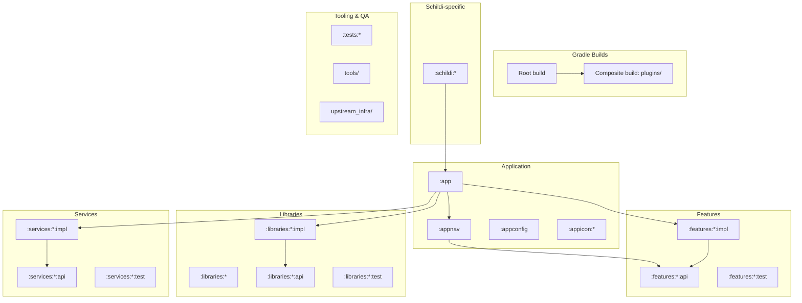

# SchildiChat Android Next (SchildiNext)

This repository is a downstream fork of Element X Android ("element-x-android"). It is a multi-module, single-activity Android app using Jetpack Compose.

## High-Level Architecture

- UI: Jetpack Compose (single Activity)
- Navigation: Appyx (Node-based navigation)
- DI: Metro (`dev.zacsweers.metro`)
- Build: Gradle Kotlin DSL + Version Catalog (`gradle/libs.versions.toml`)

## Key Entrypoints

- App manifest: `app/src/main/AndroidManifest.xml`
- Application: `app/src/main/kotlin/io/element/android/x/ElementXApplication.kt`
- Launcher activity: `app/src/main/kotlin/io/element/android/x/MainActivity.kt`
- Navigation root: `appnav/src/main/kotlin/io/element/android/appnav/RootFlowNode.kt`
- App DI graph: `app/src/main/kotlin/io/element/android/x/di/AppGraph.kt`

## Module Layout

Gradle includes modules via explicit includes + directory scanning:

- Explicit includes: `:app`, `:appnav`, `:appconfig`, `:annotations`, `:codegen`, `:appicon:*`, `:tests:*`
- Auto-included (directory scan): `features/**`, `libraries/**`, `services/**`, `schildi/**`, `enterprise/**`
- Composite build for build logic: `plugins/` (via `includeBuild("plugins")`)

See `settings.gradle.kts` for the inclusion rules.

### Mermaid: repo structure and dependency shape

## Engineering Conventions (repo-wide)

- Module pattern: most domains use `api/` + `impl/` + optional `test/` modules.
- Features should generally not depend on other features; navigation glue lives in `:appnav` / `:app`.
- DI setup: modules that participate in Metro DI call `setupDependencyInjection()` in their `build.gradle.kts`.
- Quality:
  - detekt config: `tools/detekt/detekt.yml`
  - global detekt/ktlint wiring: `build.gradle.kts`
  - aggregated checks task: `./gradlew runQualityChecks`

## Module Discovery Rules (for incremental indexing)

- `settings.gradle.kts` explicit includes + `includeProjects(...)` directory scan together define module truth.
- Module type classification should be inferred from plugin resolution (`com.android.application` vs `com.android.library`), including convention plugin indirections.
- Entrypoint identification must parse manifest `MAIN + LAUNCHER` intent-filters and include `activity-alias` cases.
- Keep library modules with minimal manifests in index; they are valid Android modules after manifest merge.

## Documentation Index (module-level)

- `app/CLAUDE.md`
- `appnav/CLAUDE.md`
- `appconfig/CLAUDE.md`
- `annotations/CLAUDE.md`
- `codegen/CLAUDE.md`
- `features/CLAUDE.md`
- `libraries/CLAUDE.md`
- `services/CLAUDE.md`
- `schildi/CLAUDE.md`
- `tests/CLAUDE.md`
- `plugins/CLAUDE.md`
- `tools/CLAUDE.md`
- `upstream_infra/CLAUDE.md`
- `docs/CLAUDE.md`

## Initialization Metadata (Incremental Refresh)

- Last refresh timestamp: `2026-02-16T18:07:52+08:00`
- Refresh mode: incremental (existing module docs reused, root index refreshed)
- Scanned files: `3424 / 6616` (~51.7%)
- Covered modules: `14 / 14` top-level documented modules
- Scan exclusions: generated/build outputs and low-signal binary-heavy paths

## Coverage Gaps and Suggested Next Deep Scan

- Continue in `features/**/impl/src/main/kotlin` for feature-owner map
- Continue in `libraries/**/{api,impl}` for API surface and internal contracts
- Continue in `services/**` for app-crosscutting boundaries
- Continue in `upstream_infra/.github/workflows/*.yml` for CI parity validation

## External Reference Baseline

- Android app architecture: <https://developer.android.com/topic/architecture>
- Android multi-module projects: <https://developer.android.com/build/multi-module>
- Gradle multi-project builds: <https://docs.gradle.org/current/userguide/multi_project_builds.html>
- Matrix client-server API: <https://spec.matrix.org/latest/client-server-api/>
